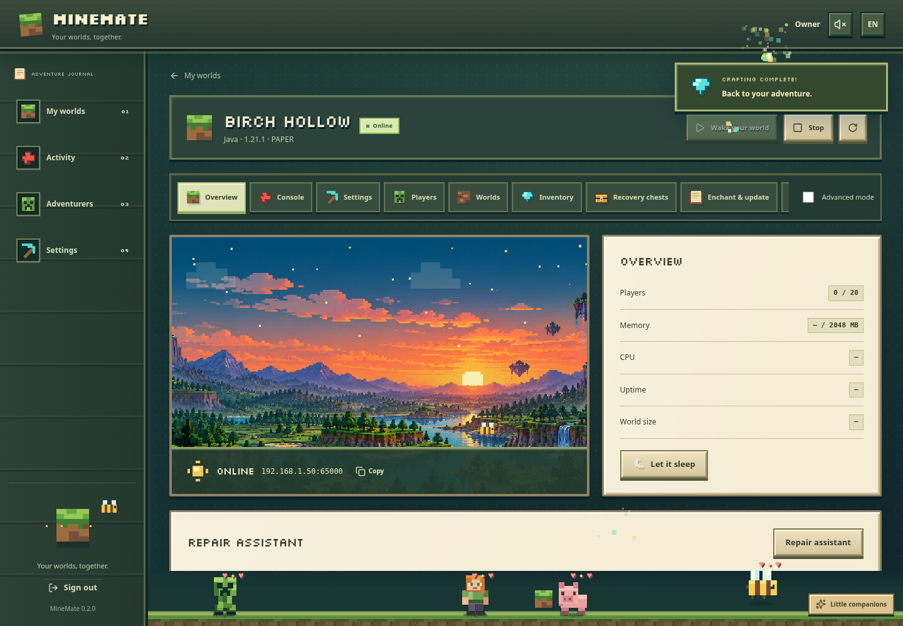

# MineMate

A self-hosted Minecraft home for your worlds and friends. MineMate manages real,
separate Docker containers for Java and Bedrock, with an English/German landscape
interface, guided setup, an inventory, configuration books and recovery chests.



## Complete upload flows · 0.3.0

Dialogs keep their heading and action buttons visible while the form scrolls.
Server controls, tabs, forms, inventory and file actions wrap at small widths;
long names fit mobile layouts and short laptop windows.

Choose the server software and either automatic download or your own server JAR
in the creation wizard. Forge and NeoForge use their installer JARs; directly
executable JARs use the custom launch flow. Server software can also be uploaded
later from Inventory. Upload multiple mod or plugin JARs separately in one batch.
They are installed into `mods/` or `plugins/`, with a recovery point and rollback.
Custom Java servers can also receive manual mod JARs.

Saved worlds can be selected as a complete folder, ZIP, or Bedrock `.mcworld`.
Relative folder paths and nested ZIP wrappers are handled, dimensions are retained,
and a wrong-edition or incomplete world is rejected. Imports protect the previous
world and restore it if startup fails. Upload progress follows the actual transfer
and operation completion. See [the upload guide](docs/UPLOADS.md).

The default **host** port is **18080**. The container continues listening on 8080.

## Adventure UI · 0.2.0

A detailed pixel landscape, inventory-style navigation, beveled wood and stone
controls, floating items, fireflies, crafting animations and celebration particles
bring the entire interface into the world. All management screens support English
and German and fit desktop and mobile layouts.

Alex, a Creeper, a pig and a bee wander along the bottom of the interface. Click a
friend to play, drag them around, or focus them and use the arrow keys. They react
to the current view: tools in the workshop, treasure near backups, portal effects
in networking, and a happy dance when an operation finishes. Their own strip keeps
the management controls accessible. The companion menu can pause, celebrate or
hide them; Settings can bring them back.

Enable the sound button for original synthesized clicks, chest sounds, portal
tones, character reactions and quiet ambient chords. Separate volume controls,
instant mute, zero-volume silence and reduced visual effects are supported.
Sound starts muted. OS reduced-motion preferences also stop decorative movement.
Assets and fonts are served locally; see [the UI guide](docs/ADVENTURE_UI.md).

To upgrade an existing installation, set
`MINEMATE_IMAGE=ghcr.io/elias02345/minemate:0.3.0` and `MINEMATE_PORT=18080` in your
existing `.env`, then run `docker compose pull` and `docker compose up -d --wait`.
Keep your existing data directory and LAN settings. Open `http://HOST-IP:18080`.
An older `.env` with `MINEMATE_PORT=8080` keeps that port until you change it.

If the registry image is unavailable, the release also provides **ready-to-load
amd64 and arm64 Docker image archives** with SHA-256 checksums. Load the matching
archive, then run Compose. See [the image archive guide](docs/IMAGE_ARCHIVES.md).

## Install with Docker Compose

Requirements: Docker Engine 25+ and Docker Compose v2 on a Linux host. Plan at
least 4 GB RAM for a small Java world. The MineMate image supports amd64 and arm64;
native Bedrock requires amd64.

Download just the two configuration files from the release:

```sh
mkdir minemate
cd minemate
curl -fL -o docker-compose.yml https://raw.githubusercontent.com/Elias02345/MineMate/docker-images-v0.3.0/docker-compose.yml
curl -fL -o .env https://raw.githubusercontent.com/Elias02345/MineMate/docker-images-v0.3.0/default.env.example
```

Set **MINEMATE_LAN_IP** in `.env` to your Docker host's LAN address, then start:

If registry publishing is still pending, first load the matching prebuilt image
with [the archive installation guide](docs/IMAGE_ARCHIVES.md).

```sh
docker compose up -d --wait
```

Compose downloads **ghcr.io/elias02345/minemate:0.3.0**. You do not need Git, Node,
source code or a local image build. The one-shot `prepare-data` service adjusts
only the data directory's owner, then the non-root MineMate service starts. It
reads the actual host bind path from Docker and verifies it with a sentinel.
Your worlds, accounts, secrets and backups live under `./data`.

Open your Docker host's LAN address on port **18080**, create your owner account,
and choose **Create a world**. Each world requires explicit Minecraft EULA
acceptance. First registration closes public signup; the owner adds members and
per-world permissions. No Minecraft server starts during Compose installation.

For another data directory, change `MINEMATE_DATA_PATH` in `.env`. The matching
absolute Docker host path is discovered automatically. See [Docker deployment](docs/DOCKER.md)
for reverse proxies, upgrades and custom configuration.

```sh
docker compose logs -f minemate    # startup and application logs
docker compose down               # stop MineMate; keep ./data
```

Minecraft containers are independent: stop worlds in the UI before stopping the
whole installation or copying its data. See [data layout](docs/DATA_LAYOUT.md).

## Use

- Create Java Vanilla, Paper, Purpur, Fabric, Forge, NeoForge or trusted Custom JAR
  worlds, or official Bedrock worlds. The wizard chooses a suitable Java runtime.
- Start, stop, restart or sleep worlds; watch actual protocol readiness, resource
  samples, players and bounded console logs. Commands go to Minecraft.
- Change grouped settings, resources, ports and idle sleep through forms.
- Search Modrinth or CurseForge, preview compatible versions/dependencies, install
  verified downloads, import server modpacks and upload trusted JARs.
- Pack, download and restore verified full-server ZIP backups. Set retention,
  scheduled backups or an optional S3 destination. Recovery precedes mutations.
- Use Advanced Mode for files, syntax-highlighted configuration editing, diffs,
  permission grants, loader versions and JVM flags.
- Copy the LAN target into CloudGate for optional external access. Bedrock needs
  a UDP-capable tunnel. No CloudGate account is required for LAN use.

CurseForge requires an administrator's API key. S3 requires a bucket and
credentials. Configure both graphically; keys are encrypted and never returned
in API responses. Modrinth and local management need neither integration.

## Development and verification

Node 24.19.0 and npm are required.

```sh
npm ci
npm run check
npm run test:docker         # disposable real Docker Engine test
npm run test:e2e            # controlled Minecraft protocol/browser fixtures
npm run dev                # backend
npm run dev:web            # frontend, in a second terminal
```

`npm run check` runs strict type checking, lint, unit/API tests and both production
builds. Browser fixtures explicitly identify their runtime as a test fixture.
Production code never creates example worlds or fabricated metrics.

Read [validation evidence](docs/VALIDATION.md) for the exact real-runtime coverage
and remaining integration limitations. Real Minecraft tests are opt-in and need
explicit EULA authorization; CI never needs Mojang downloads.

## Documentation

[Architecture](docs/ARCHITECTURE.md) · [Data layout](docs/DATA_LAYOUT.md) ·
[Docker](docs/DOCKER.md) · [Backups](docs/BACKUPS.md) ·
[CloudGate](docs/CLOUDGATE.md) · [Security](docs/SECURITY.md) ·
[Development](docs/DEVELOPMENT.md) · [Validation](docs/VALIDATION.md)

The artwork is centralized in `packages/ui`: replaceable SVG pixel assets,
landscape layers, tokens, components and optional synthesized sound. Sound is
muted by default. Reduced motion and reduced effects are supported.
